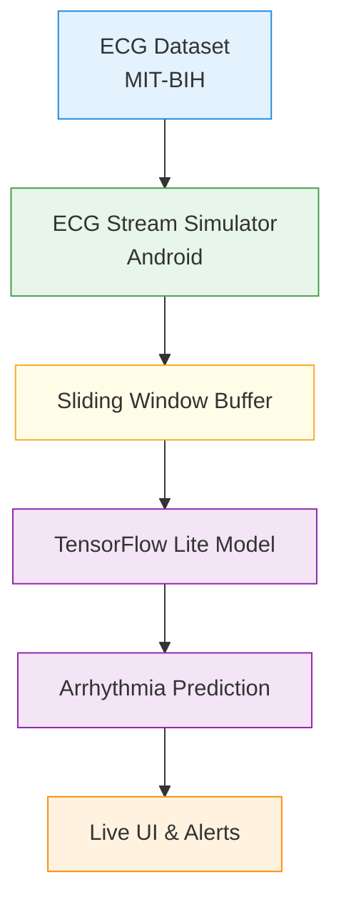

# Arrhythmia Detection Android App (Real-Time Simulation)

An Android application that performs **real-time arrhythmia detection using deep learning**.  
The system demonstrates **on-device ECG inference** using a trained neural network, without requiring physical ECG hardware.

ECG signals are streamed from **validated medical datasets** and replayed in real time to simulate live acquisition, making this project suitable for academic demos, capstone projects, and proof-of-concepts.

---

## Problem Statement

Cardiac arrhythmias are abnormal heart rhythms that can lead to serious health risks if not detected early.  
Continuous ECG monitoring systems are often expensive, hardware-dependent, and not easily accessible.

This project explores a **software-first, hardware-independent approach** to arrhythmia detection using:
- Deep learning
- Edge AI (on-device inference)
- Real-time ECG signal visualization on Android

---

## Key Features

- Real-time ECG waveform visualization
- On-device deep learning inference (TensorFlow Lite)
- Arrhythmia classification (Normal / Abnormal)
- Low-latency predictions (no cloud dependency)
- Confidence score and inference time display
- Dataset-driven ECG stream simulation
- Android-native implementation

---

## Development Roadmap

### Dataset & Model Preparation
- [x] Download and explore MIT-BIH Arrhythmia Dataset
- [x] Extract ECG signals and corresponding labels
- [x] Normalize ECG signal values
- [x] Segment ECG into fixed-length windows / beats
- [x] Prepare training and validation datasets

### Deep Learning Model
- [x] Design lightweight 1D CNN architecture for ECG classification
- [x] Train model on preprocessed ECG data
- [x] Evaluate model accuracy and loss
- [x] Optimize model for mobile inference
- [x] Convert trained model to TensorFlow Lite (`.tflite`)

### Android Project Setup
- [ ] Create Android project using Kotlin and Jetpack Compose
- [ ] Add ECG waveform rendering using Canvas / MPAndroidChart
- [ ] Implement lifecycle-aware real-time data updates

### ECG Stream Simulation
- [ ] Load ECG signal files into Android app
- [ ] Implement timed ECG sample emitter (simulated real-time stream)
- [ ] Smoothly scroll ECG waveform on UI
- [ ] Display real-time BPM estimation

### On-Device Inference
- [ ] Integrate TensorFlow Lite interpreter
- [ ] Implement sliding window buffer for ECG samples
- [ ] Run periodic inference on buffered data
- [ ] Display predicted rhythm class and confidence score

### Alerts & User Interaction
- [ ] Detect abnormal / arrhythmic heart rhythms
- [ ] Trigger phone vibration on arrhythmia detection
- [ ] Display visual alert for abnormal rhythm
- [ ] Show prominent **SOS button** on arrhythmia detection
- [ ] Log detected arrhythmia events with timestamps

### Finalization & Demo Prep
- [ ] Optimize UI performance and inference latency
- [ ] Add model accuracy and inference time information
- [ ] Record app demo video
- [ ] Finalize README documentation
- [ ] Prepare presentation slides and explanation

---

## Technology Stack

### Android
- Kotlin
- Jetpack Compose
- MPAndroidChart / Custom Canvas
- TensorFlow Lite
- ViewModel + StateFlow

### Machine Learning
- Python
- TensorFlow / Keras
- 1D Convolutional Neural Network (CNN)
- MIT-BIH Arrhythmia Dataset
- TFLite model conversion

---

## System Architecture

---

## Simulation vs Reality (Transparency)

| Component | Status |
|--------|--------|
| ECG signal source | Real medical dataset |
| Deep learning model | Fully trained |
| Inference | On-device (TFLite) |
| Real-time display | Simulated timing |
| Hardware ECG sensor | Not used |

> ECG data is replayed sample-by-sample using a timing mechanism to simulate real-time acquisition.  
> Hardware integration (BLE ECG devices) is planned as future work.

---

## Dataset

- **MIT-BIH Arrhythmia Database**
- Publicly available, clinically validated ECG recordings
- Beat-level annotations

Used classes:
- Normal rhythm
- Ventricular ectopic / abnormal rhythm
- Other arrhythmic patterns (merged for MVP)

---

## Deep Learning Model

- Input: 1D ECG signal window
- Architecture: 1D CNN
- Output: Arrhythmia class probabilities
- Optimized for:
    - Fast inference
    - Mobile deployment
    - Low memory usage

Model is converted to **TensorFlow Lite** for Android execution.

---

## Android App Flow

1. ECG samples are loaded from dataset files
2. Samples are emitted at ECG-like frequency
3. A sliding window buffers recent samples
4. Model inference runs periodically
5. UI updates waveform, prediction, and alerts

---

## Future Enhancements

- Bluetooth ECG device integration
- Multi-lead ECG support
- Advanced arrhythmia classification
- Cloud sync and history tracking
- WearOS companion app
- Medical-grade validation

---

## Disclaimer

This application is a **research and educational project** and is **not intended for medical diagnosis or treatment**.