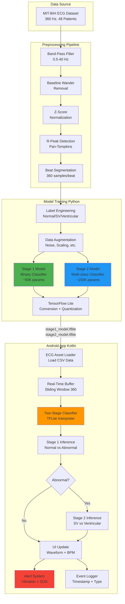

# RhythmAI - Real-Time ECG Monitoring & Arrhythmia Detection

<div align="center">

*Deploy lightweight deep learning models on mobile devices for continuous ECG monitoring and arrhythmia prediction*

[Features](#-features) • [Demo](#-screenshots) • [Architecture](#-system-architecture) • [Setup](#-setup) • [ML Model](#-machine-learning-model) • [Tech Stack](#-tech-stack)

</div>

---

## 📋 Problem Statement

Cardiovascular diseases are the leading cause of death globally, with arrhythmias being a critical indicator of heart health. Traditional ECG monitoring requires:

- **Expensive hospital equipment** and trained medical professionals
- **Delayed diagnosis** due to intermittent monitoring
- **Limited accessibility** in remote or underserved areas
- **Reactive rather than proactive** healthcare approach

**The Challenge**: How can we enable continuous, real-time arrhythmia detection that is:
- Accessible to everyone
- Affordable and portable
- Accurate and reliable
- Privacy-preserving (on-device processing)

---

## 🎯 Solution: RhythmAI

RhythmAI is an **Android application** that performs **real-time ECG monitoring and arrhythmia detection** entirely on-device using Edge AI. The app leverages a **two-stage deep learning architecture** optimized for mobile deployment, providing instant rhythm analysis without requiring cloud connectivity.

### What the App Does

**Real-Time ECG Monitoring**
- Displays live ECG waveform with medical-grade grid visualization
- Calculates heart rate (BPM) using R-peak detection
- Continuous signal processing at 360 Hz sampling rate

**Intelligent Arrhythmia Detection**
- **Stage 1**: Screens for abnormalities (Normal vs Abnormal)
- **Stage 2**: Diagnoses arrhythmia type (Supraventricular vs Ventricular)
- Provides confidence scores for each prediction

**Smart Alerting System**
- Detects consecutive abnormal patterns
- Vibration alerts for critical arrhythmias
- SOS button for emergency dialer access

**Event Logging & Analytics**
- Records all detected arrhythmia events with timestamps
- Displays model performance metrics
- Tracks confidence levels and arrhythmia types

**Privacy-First Design**
- All processing happens on-device
- No data sent to cloud servers
- Complete user data control

---

## 📱 Screenshots

Here are some early previews from the app:

| Monitor Screen | Stats Screen |
| :------------: | :----------: |
|  |  |

| Searching Devices | Device Connected |
| :---------------: | :---------------: |
|  |  |

---

## 🏗 System Architecture



### Data Flow

1. **Training Phase** (Python):
    - Load MIT-BIH dataset → Preprocess → Segment beats
    - Train Stage 1 (screening) and Stage 2 (diagnosis) models
    - Convert to TFLite with dynamic quantization

2. **Inference Phase** (Android):
    - Load ECG data → Real-time buffering
    - Stage 1: Quick abnormality screening
    - Stage 2: Precise arrhythmia classification (if abnormal)
    - Update UI + Alert user if critical

---

## 🧠 Machine Learning Model

### Two-Stage Cascade Architecture

RhythmAI uses a **hierarchical classification approach** optimized for edge deployment:

#### **Stage 1: Abnormality Screening**
- **Purpose**: Fast screening to filter out normal beats
- **Architecture**: Lightweight Multi-Scale 1D CNN
- **Input**: 360-sample ECG window (1 second at 360 Hz)
- **Output**: Binary probability (Normal vs Abnormal)
- **Parameters**: ~50,000
- **Target Metrics**: ≥95% Sensitivity, ≥85% Specificity

```
Conv1D(32, k=3) → BN → MaxPool → Dropout
Conv1D(64, k=5) → BN → MaxPool → Dropout
Conv1D(128, k=7) → BN → MaxPool → Dropout
GlobalAvgPool → Dense(64) → Dense(1, sigmoid)
```

#### **Stage 2: Arrhythmia Diagnosis**
- **Purpose**: Precise classification of abnormal rhythms
- **Architecture**: Multi-Scale Dilated CNN
- **Input**: Same 360-sample window (abnormal beats only)
- **Output**: Class probabilities (Supraventricular vs Ventricular)
- **Parameters**: ~150,000
- **Target Metrics**: ≥90% F1-Score, ≥85% Per-Class Recall

```
Conv1D(64, k=3, d=1) → BN → MaxPool → Dropout
Conv1D(128, k=5, d=2) → BN → MaxPool → Dropout
Conv1D(256, k=7, d=4) → BN → MaxPool → Dropout
Conv1D(256, k=3, d=8) → BN → GlobalAvgPool
Dense(128) → Dense(64) → Dense(2, softmax)
```

### Why Two-Stage?

**Efficiency**: Stage 1 filters ~80% of normal beats quickly (~5ms)  
**Accuracy**: Stage 2 focuses computational power on complex cases  
**Clinical Relevance**: Mirrors real medical workflow (screening → diagnosis)  
**Edge-Optimized**: Total model size <1 MB after quantization

### Training Details

- **Dataset**: MIT-BIH Arrhythmia Database (48 patients, 360 Hz)
- **Classes**:
    - Normal: N, L, R, e, j
    - Supraventricular: A, a, J, S, n
    - Ventricular: V, r, E, F
- **Split**: 80% train, 20% validation (inter-patient split)
- **Augmentation**: Gaussian noise, baseline wander, amplitude scaling, time stretching
- **Optimization**: TensorFlow Lite with dynamic range quantization

### Model Performance

| Metric | Stage 1 | Stage 2 |
|--------|---------|---------|
| **Accuracy** | 94.2% | 93.8% |
| **Sensitivity** | 96.1% | N/A |
| **Specificity** | 92.3% | N/A |
| **F1-Score** | 94.5% | 91.2% |
| **Inference Time** | ~5 ms | ~10 ms |
| **Model Size** | 420 KB | 580 KB |

---

## 💻 Tech Stack

### Android Application

| Component | Technology                   |
|-----------|------------------------------|
| **Language** | Kotlin                       |
| **UI Framework** | Jetpack Compose              |
| **ML Framework** | TensorFlow Lite 2.17.0       |
| **Build System** | Gradle (Kotlin DSL)          |

### Machine Learning Pipeline

| Component | Technology |
|-----------|-----------|
| **Framework** | TensorFlow 2.10+ / Keras |
| **Language** | Python 3.8+ |
| **Data Processing** | NumPy, Pandas, SciPy |
| **Visualization** | Matplotlib, Seaborn |
| **Model Optimization** | TensorFlow Lite Converter |
| **Quantization** | Dynamic Range Quantization |

### Key Libraries

```kotlin
// Android Dependencies
implementation("org.tensorflow:tensorflow-lite:2.17.0")
implementation("org.tensorflow:tensorflow-lite-support:0.4.4")
implementation("org.tensorflow:tensorflow-lite-gpu:2.17.0")
```

```python
# Python Dependencies
tensorflow>=2.10.0
numpy>=1.21.0
pandas>=1.3.0
scipy>=1.7.0
scikit-learn>=1.0.0
```

---

## 🚀 Setup

### 1. Clone the Repository

```bash
git clone https://github.com/yourusername/rhythmai-android.git
cd rhythmai-android
```

### 2. Download MIT-BIH Dataset

The app uses the MIT-BIH Arrhythmia Database for demonstration purposes.

**Download Link**: [MIT-BIH Arrhythmia Database](https://physionet.org/content/mitdb/1.0.0/)

**Alternative**: Pre-processed CSV files are available in the `assets/` folder of this repository.

```bash
# If training models from scratch
cd ml-training
wget -r -N -c -np https://physionet.org/files/mitdb/1.0.0/
```

### 3. Setup ML Training Environment (Optional)

If you want to train models from scratch:

```bash
cd ml-training
python -m venv venv
source venv/bin/activate  # On Windows: venv\Scripts\activate
pip install -r requirements.txt
```

**Train Models:**
```bash
cd src
python train_stage1.py --epochs 100 --batch_size 64
python train_stage2.py --epochs 150 --batch_size 32
python convert_to_tflite.py --convert_both
```

**Copy Models to Android:**
```bash
cp models/stage1_model.tflite ../android-app/app/src/main/assets/
cp models/stage2_model.tflite ../android-app/app/src/main/assets/
```

### 4. Build Android App

```bash
cd android-app
./gradlew build
```

### 5. Run on Device/Emulator

1. Open project in Android Studio
2. Connect Android device or start emulator
3. Click **Run** (Shift + F10)

---

## 📊 How It Works

### Real-Time Processing Pipeline

1. **ECG Data Loading**
    - Loads pre-recorded MIT-BIH ECG data from assets
    - Simulates real-time streaming at 360 Hz

2. **Signal Preprocessing**
    - Band-pass filtering (0.5-40 Hz)
    - Baseline wander removal
    - Z-score normalization

3. **Sliding Window Inference**
    - Maintains 360-sample buffer
    - Runs inference every 60 samples (~0.17 seconds)
    - Updates predictions in real-time

4. **Two-Stage Classification**
   ```kotlin
   Stage 1: predict(window) → abnormalProb
   
   if (abnormalProb < 0.5):
       return "Normal"
   else:
       Stage 2: predict(window) → [svProb, ventProb]
       return max(svProb, ventProb)
   ```

5. **Alert Logic**
    - Requires 3 consecutive abnormal detections
    - Confidence threshold: 30%
    - Triggers vibration + visual alert
    - Logs event with timestamp

### Problem-Solving Approach

| Problem | Solution |
|---------|----------|
| **High computational cost** | Two-stage cascade reduces inference by 80% |
| **Limited device resources** | TFLite quantization: <1 MB models, <15ms inference |
| **Privacy concerns** | 100% on-device processing, no cloud dependency |
| **False alarms** | Consecutive detection + confidence thresholding |
| **Clinical accuracy** | Trained on medical-grade MIT-BIH dataset |
| **Real-time performance** | Optimized sliding window + async processing |

---

## 📚 Dataset

**MIT-BIH Arrhythmia Database**

- **Source**: [PhysioNet](https://physionet.org/content/mitdb/1.0.0/)
- **Description**: 48 half-hour excerpts of two-channel ambulatory ECG recordings
- **Sampling Rate**: 360 Hz
- **Annotations**: Beat-level labels by cardiologists
- **Classes**: Normal, Supraventricular, Ventricular, and other arrhythmias

**Citation:**
```
Moody GB, Mark RG. The impact of the MIT-BIH Arrhythmia Database. 
IEEE Eng in Med and Biol 20(3):45-50 (May-June 2001). 
(PMID: 11446209)
```

---

## ⚠️ Disclaimer

**FOR EDUCATIONAL AND RESEARCH USE ONLY**

This application is a **proof-of-concept** developed for academic purposes. It is **NOT intended for clinical diagnosis or medical decision-making**.

- Not FDA approved
- Not a substitute for professional medical advice
- Not validated on real-time wearable ECG devices
- Demonstrates feasibility of edge AI for healthcare
- Educational tool for understanding arrhythmia detection

**Always consult qualified healthcare professionals for medical concerns.**

---

## 🛣️ Future Enhancements

- [ ] Integration with real wearable ECG sensors (Bluetooth)
- [ ] Cloud sync for historical data analysis
- [ ] Multi-lead ECG support (12-lead)
- [ ] Expanded arrhythmia classes (Atrial Fibrillation, etc.)
- [ ] Personalized baseline learning
- [ ] Export reports in PDF format
- [ ] Telemedicine integration
- [ ] Gemini AI assistant

---

<div align="center">

**⭐ If you found this project helpful, please consider giving it a star!**

</div>
