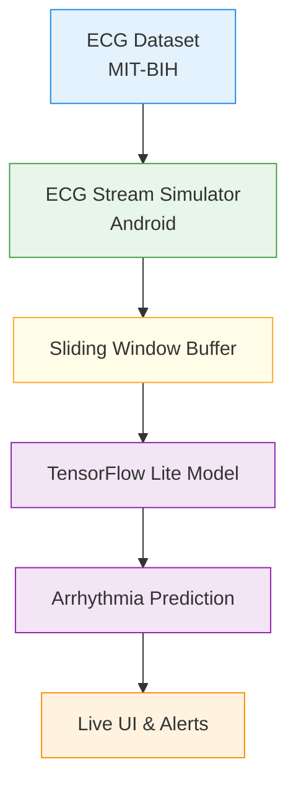

# Arrhythmia Detection Android App (Real-Time Simulation)

An Android application that performs **real-time arrhythmia detection using deep learning**.  
The system demonstrates **on-device ECG inference** using a trained neural network, without requiring physical ECG hardware.

ECG signals are streamed from **validated medical datasets** and replayed in real time to simulate live acquisition, making this project suitable for academic demos, capstone projects, and proof-of-concepts.

---

## Problem Statement

Cardiac arrhythmias are abnormal heart rhythms that can lead to serious health risks if not detected early.  
Continuous ECG monitoring systems are often expensive, hardware-dependent, and not easily accessible.

This project explores a **software-first, hardware-independent approach** to arrhythmia detection using:
- Deep learning
- Edge AI (on-device inference)
- Real-time ECG signal visualization on Android

---

## Key Features

- Real-time ECG waveform visualization
- Multi-class arrhythmia detection (Normal, Supraventricular, Ventricular)
- On-device deep learning inference using TensorFlow Lite
- Low-latency predictions with no cloud dependency
- Confidence score–based rhythm classification
- Temporal smoothing and consecutive abnormal detection
- Persistent SOS alert for detected arrhythmia
- Real-time heart rate (BPM) estimation
- Arrhythmia event logging with timestamps and confidence
- Dataset-driven real-time ECG stream simulation
- Android-native implementation using Kotlin and Jetpack Compose
- Edge AI–focused design with privacy-preserving inference
- Extensible architecture for future AI assistant integration

---

## Development Roadmap

### Dataset & Signal Preparation
- [x] Download and explore MIT-BIH Arrhythmia Dataset
- [x] Analyze ECG sampling frequency and signal characteristics
- [x] Extract ECG signals and corresponding annotation labels
- [x] Normalize ECG signal values (z-score normalization)
- [x] Segment ECG into fixed-length beat-centered windows (360 samples)
- [x] Expand dataset to include multiple patient records
- [x] Perform inter-patient train–validation split to avoid data leakage
- [x] Map annotation symbols into clinically meaningful rhythm classes
    - Normal
    - Supraventricular Arrhythmia
    - Ventricular Arrhythmia

---

### Signal Processing Enhancement
- [x] Apply band-pass filtering (0.5–40 Hz) to remove baseline wander and noise
- [x] Compare raw vs filtered ECG signals
- [ ] Implement and analyze R-peak detection accuracy
- [x] Justify window size and stride based on ECG physiology

---

### Deep Learning Model Development
- [x] Design lightweight 1D CNN architecture optimized for edge devices
- [x] Train CNN model on preprocessed ECG segments
- [x] Extend model from binary to multi-class classification
- [x] Evaluate model using medical metrics:
    - Accuracy
    - Sensitivity (Recall)
    - Specificity
    - F1-score
    - Confusion matrix
- [ ] Compare CNN performance with an alternative lightweight architecture
- [x] Analyze overfitting and generalization behavior

---

### Edge AI Optimization & Deployment
- [x] Convert trained Keras model to TensorFlow Lite format
- [x] Apply post-training quantization (INT8 / dynamic range)
- [x] Measure model size reduction after quantization
FP32 model size: 713.47 KB
INT8 model size: 185.18 KB
Reduction: 74.05%
- [ ] Benchmark inference latency on Android device
- [ ] Analyze power and performance trade-offs for edge inference
- [ ] Justify on-device inference over cloud-based solutions (privacy & latency)

---

### Android Application Development
- [x] Create Android project using Kotlin and Jetpack Compose
- [x] Implement real-time ECG waveform rendering
- [x] Build lifecycle-aware streaming pipeline
- [x] Display real-time heart rate (BPM) estimation
- [x] Maintain smooth UI updates under continuous data flow

---

### Real-Time ECG Stream Simulation
- [x] Load ECG signal data from assets
- [x] Simulate real-time ECG data streaming (~360 Hz)
- [x] Implement circular buffer for ECG samples
- [x] Maintain sliding window for continuous inference
- [x] Control inference frequency to balance latency and accuracy

---

### On-Device Arrhythmia Inference
- [x] Integrate TensorFlow Lite interpreter in Android
- [x] Perform real-time inference using sliding ECG windows
- [x] Display predicted rhythm class with confidence score
- [x] Smooth prediction outputs to reduce false positives
- [x] Track consecutive abnormal detections for reliability

---

### Alerts, Safety & User Interaction
- [x] Detect abnormal cardiac rhythms in real time
- [x] Trigger haptic feedback (vibration) on arrhythmia detection
- [x] Display visual alerts for abnormal rhythms
- [x] Provide emergency **SOS** action option
- [x] Log arrhythmia events with timestamps and confidence
- [ ] Add medical disclaimer and safety notice
- [ ] Implement alert cooldown to prevent alarm fatigue

---

### Evaluation & Performance Analysis
- [ ] Compare model performance before and after optimization
- [ ] Measure real-time inference latency on mobile device
- [ ] Analyze detection delay in streaming scenario
- [ ] Evaluate false positive and false negative cases
- [ ] Discuss limitations and failure cases

---

### Finalization & Demonstration
- [ ] Optimize UI rendering and inference pipeline
- [ ] Display model accuracy and inference time within app
- [ ] Record real-time app demonstration video
- [ ] Finalize project documentation and README
- [ ] Prepare final presentation and viva explanation
- [ ] Outline future work (wearables, BLE ECG sensors, clinical validation)

---

## Technology Stack

### Android
- Kotlin
- Jetpack Compose
- MPAndroidChart / Custom Canvas
- TensorFlow Lite
- ViewModel + StateFlow

### Machine Learning
- Python
- TensorFlow / Keras
- 1D Convolutional Neural Network (CNN)
- MIT-BIH Arrhythmia Dataset
- TFLite model conversion

---

## System Architecture

---

## Simulation vs Reality (Transparency)

| Component | Status |
|--------|--------|
| ECG signal source | Real medical dataset |
| Deep learning model | Fully trained |
| Inference | On-device (TFLite) |
| Real-time display | Simulated timing |
| Hardware ECG sensor | Not used |

> ECG data is replayed sample-by-sample using a timing mechanism to simulate real-time acquisition.  
> Hardware integration (BLE ECG devices) is planned as future work.

---

## Dataset

- **MIT-BIH Arrhythmia Database**
- Publicly available, clinically validated ECG recordings
- Beat-level annotations

Used classes:
- Normal rhythm
- Ventricular ectopic / abnormal rhythm
- Other arrhythmic patterns (merged for MVP)

---

## Deep Learning Model

- Input: 1D ECG signal window
- Architecture: 1D CNN
- Output: Arrhythmia class probabilities
- Optimized for:
    - Fast inference
    - Mobile deployment
    - Low memory usage

Model is converted to **TensorFlow Lite** for Android execution.

---

## Android App Flow

1. ECG samples are loaded from dataset files
2. Samples are emitted at ECG-like frequency
3. A sliding window buffers recent samples
4. Model inference runs periodically
5. UI updates waveform, prediction, and alerts

---

## Future Enhancements

- Bluetooth ECG device integration
- Multi-lead ECG support
- Advanced arrhythmia classification
- Cloud sync and history tracking
- WearOS companion app
- Medical-grade validation

---

## Disclaimer

This application is a **research and educational project** and is **not intended for medical diagnosis or treatment**.